# 🛡️ RozgarShield — Parametric Income Protection for Q-Commerce Delivery Workers

---

## 🎯 Our Idea

**RozgarShield** is a parametric insurance platform that automatically detects external disruptions and compensates Q-Commerce delivery workers (Zepto/Blinkit) for income loss — with **zero manual claims, zero paperwork, and instant UPI payouts**.

---

## 💡 Problem Statement

> *"Delivery partners in quick-commerce platforms lose income when external disruptions reduce or stop order availability, even when they are active and ready to work. These disruptions are beyond their control, and currently, there is no automated financial protection system for such income loss."*

### Why Q-Commerce Workers Are Uniquely Vulnerable

| Risk Factor | Impact |
|---|---|
| **Single Dark Store Dependency** | One store serves an entire zone. Store disruption = zero orders = zero income |
| **Strict 10-Minute SLA** | Any delay causes order cancellations and system slowdowns |
| **Hyper-Local Zones** | Workers operate in tiny zones — a local disruption has 100% impact |
| **External Weather Events** | Rain, flood, extreme heat halts deliveries entirely |
| **Social Disruptions** | Curfews, local strikes block access to pickup/drop zones |

---

## 👤 Persona

**Platform:** Zepto / Blinkit (Q-Commerce / Grocery Delivery)

**User Profile:**
- Delivery partner operating in a hyper-local zone (1–3 km radius)
- Earns ₹600–₹1,200/day depending on order volume
- Works 6–10 hours/day, operates week-to-week financially
- No existing financial safety net for disruption-based income loss

**Scenario Example:**
> Ravi is a Zepto delivery partner in Bangalore. On a Tuesday, heavy rainfall triggers a flood alert in his zone. His dark store halts operations. Despite being active and ready to work, Ravi receives zero orders for 6 hours and loses ~₹400. Under RozgarShield, the system detects the rainfall event, verifies Ravi was active, and automatically processes a payout — no claim needed.

---

## ⚙️ System Workflow

```text
Worker Registers (Name + Phone + OTP Verification)
       ↓
AI Calculates Weekly Premium (Zone Risk + Weather + Tenure)
       ↓
Real-Time Monitoring (Weather Events + GPS + Platform Signals)
       ↓
Disruption Detected → Trigger Fires Automatically
       ↓
Worker Activity Verified (GPS + Online Status)
        ↓
4-Layer Fraud Detection (GPS Spoofing + Weather Cross-Check + Behavioral + Tiers)
        ↓
Income Loss Calculated (Expected vs Actual Income Gap)
        ↓
Instant Payout via Razorpay → UPI Credit
```

---

## System Architecture

> Full end-to-end architecture showing Flutter apps, Node.js backend, PostgreSQL database, and cloud deployment.



### Parametric Trigger Design

.svg)

### Architecture Overview

| Layer | Technology | Purpose |
|---|---|---|
| **Worker App** | Flutter (Web/iOS/Android) | Onboarding, OTP, Policy, Claims, Trigger alerts |
| **Admin App** | Flutter (Web/iOS/Android) | Dashboard, Analytics, Zone risk, Plan management |
| **Backend API** | Node.js + Express.js | 35+ REST endpoints, business logic modules |
| **AI/ML Service** | Python + FastAPI + XGBoost | Zone risk prediction (91.67% accuracy) |
| **Payment Gateway** | Razorpay (Test Mode) | UPI payouts, order creation, signature verification |
| **Database** | PostgreSQL (Neon) | Workers, policies, claims, payouts, triggers, config |
| **Deployment** | Render + Neon + Vercel | Cloud deployment |

---

### 🧭 Design to Implementation Journey

| Design (Planned) | Implementation (Built) |
|---|---|
| Parametric trigger concept | Working trigger engine with node-cron |
| AI premium formula on paper | Live premiumEngine.js calculating real premiums |
| Wireframe onboarding flow | Full Flutter app with GPS + OTP |
| Fraud detection logic defined | GPS validation + duplicate prevention live |
| Architecture diagram | Deployed on Render with PostgreSQL on Neon |

---

### 📐 System Design Decisions

Our team focused on deep problem analysis before writing code:

- Identified that Q-commerce workers face a **unique structural vulnerability** — hyper-local zones mean one disruption = 100% income loss
- Designed the **parametric trigger system** — real-world events automatically fire payouts without any manual claim
- Mapped out the **AI premium engine** — dynamic pricing based on zone risk, weather forecast, and worker tenure
- Defined **fraud detection layers** — GPS spoofing detection, behavioral anomaly flags, duplicate claim prevention
- Built the full **system architecture** — Flutter apps, Node.js backend, PostgreSQL, Docker

---

## ⚡ Parametric Triggers

The system uses parametric triggers to automatically detect disruptions affecting gig workers. Instead of manual claims, payouts are triggered based on real-time external data sources.

### Trigger Coverage by Plan

| Trigger | Tier | Payout | Basic | Standard | Pro |
|---|---|---|---|---|---|
| Heavy Rain | T2 | 50% | ✅ | ✅ | ✅ |
| Extreme Heat | T1 | 25% | ✅ | ✅ | ✅ |
| Flood Alert | T3 | 100% | ❌ | ✅ | ✅ |
| Severe AQI | T2 | 50% | ❌ | ✅ | ✅ |
| Curfew | T3 | 100% | ❌ | ❌ | ✅ |
| Cyclone | T3 | 100% | ❌ | ❌ | ✅ |
| Platform Order Crash | T2 | 50% | ❌ | ✅ | ✅ |
| Full Platform Shutdown | T3 | 100% | ❌ | ❌ | ✅ |

### Core Trigger Logic

```text
IF (Trigger Detected)
AND (Worker is Active in Zone)
AND (Income Drop Confirmed)
AND (Fraud Check Passed)
→ Instant Payout Released
```

---

## 💰 Weekly Pricing Model

### Base Weekly Premium Tiers

| Plan | Weekly Premium | Max Weekly Payout | Triggers Covered |
|---|---|---|---|
| Basic | ₹29/week | ₹500/week | 2 of 6 |
| Standard | ₹49/week | ₹900/week | 4 of 6 |
| Pro | ₹79/week | ₹1,500/week | 6 of 6 |

### AI-Adjusted Pricing Factors

The premium engine dynamically adjusts weekly rates using:

- **Zone Risk Score** — historical flood/disruption frequency
- **Seasonal Weather Forecast** — upcoming week prediction
- **Worker Tenure** — loyalty discounts for long-serving workers
- **Platform Reliability Score** — dark store uptime history in zone

> Example: Koramangala (High Risk) → Base ₹49 + Zone Adjustment ₹14 + Weather Risk ₹5 = **Final ₹68/week**

---

## 🤖 AI/ML Integration

### Core Philosophy: Income Loss First

RozgarShield focuses on accurate income loss prediction combined with verified external triggers.

```text
Predict Expected Earnings → Compare with Actual → Calculate Income Gap → Trigger if Valid External Disruption
```

### Models Used

**1. Risk Assessment Model (XGBoost) — ✅ LIVE**
- **Training Data:** 600 realistic synthetic samples across Indian cities
- **Features (6):** avg_monthly_rain_mm, flood_events_per_year, aqi_bad_days_per_month, dark_store_outages_month, avg_wind_speed_kmh, extreme_heat_days_month
- **Accuracy:** 91.67% on test set
- **Output:** LOW / MEDIUM / HIGH risk score → maps to premium adjustment
- **Serving:** Python FastAPI (`/predict-risk`, `/model-info`) — deployed on Render

**2. Income Prediction Model (Prophet / LSTM)**
- Input: Worker's past 4-week earnings, day-of-week, time-of-day, weather
- Output: Expected income baseline → calculates income loss gap

**3. Dynamic Premium Engine — ✅ LIVE**
- Combines risk score + income prediction + zone conditions
- Recalculates every week before policy renewal
- All thresholds stored in `app_config` table (zero hardcoded values)

### Decision Engine

```text
External Trigger
     +
Worker Active (GPS verified)
     +
Income Gap Detected (Expected > Actual)
     +
Fraud Check Passed
     ↓
PAYOUT APPROVED ✅
```

### Fraud Detection System — ✅ 4-Layer Engine (LIVE)

**Layer 1: Weather Cross-Verification**
- Validates claimed trigger against real-time OpenWeatherMap data
- If worker claims "heavy rain" but weather API shows sunny → FRAUD FLAG

**Layer 2: Behavioral Analysis**
- Claims frequency check (max per week from `app_config`)
- Claims-to-active-days ratio analysis

**Layer 3: GPS Spoofing Detection**
- Haversine distance calculation between last known GPS and zone center
- Teleportation check: if distance > threshold in < time window → FLAG
- Uses `last_lat`, `last_lon`, `last_gps_time` columns on workers table

**Layer 4: Fraud Response Tiers**

| Risk Score | Action | Pipeline |
|---|---|---|
| 🟢 0-29 | Approve immediately | Claim created, payout processed |
| 🟡 30-69 | Hold for review | Claim created, status = `processing` |
| 🔴 70-100 | Block automatically | Claim rejected, worker flagged |

**Admin Fraud Dashboard:**
- `GET /admin/fraud` — View all flagged claims with reasons
- `PUT /admin/fraud/:id/resolve` — Approve or reject held claims

---

## 📱 What We Built

---

### 👷 Worker App (Flutter — Web/iOS/Android)

The worker app is the primary product — what a Zepto or Blinkit delivery partner installs and uses daily.

**Onboarding Flow:**
- 2-step signup — name, phone number, select delivery zone (GPS auto-detects)
- OTP verification screen — 6-digit code, 30-second countdown timer, shake animation on wrong entry
- Plan selection with **segmented control** — switch between "Weekly Premium" view and "Comparison" table to compare Basic / Standard / Pro side by side

**Policy Dashboard:**
- Live coverage status card showing plan name, premium paid, max payout, days remaining
- Trigger breakdown — which events are covered, at what payout tier
- Quick stats — remaining days, active triggers, fraud flags
- One-tap **PDF policy certificate** generation and download

**Auto Demo Trigger (Key Feature):**
- 5–10 seconds after login, a trigger fires automatically
- Calls `POST /demo/trigger` on the backend
- Simulates Heavy Rain / Flood / Extreme Heat / Severe AQI
- Immediately creates a claim and shows the payout flow

**Trigger Alert Flow (5-Screen Sequence):**
```text
Screen 1: Trigger Detected    → Zone + Event type shown
Screen 2: GPS Verified        → Worker location confirmed in zone
Screen 3: Fraud Check Passed  → Clean behavior, no flags
Screen 4: Claim Approved      → Amount calculated from tier
Screen 5: Payout Animation    → ₹750 credited to UPI (simulated)
```

**Claims Tab:** Full history of all past claims with status, amount, trigger type, and date.

**Profile Tab:** Worker ID, zone, platform, plan, logout with confirmation dialog.

---

### 🖥️ Admin App (Flutter — Web/iOS/Android)

The admin app gives the RozgarShield operations team full real-time visibility and control.

**Dashboard:**
- Live KPI cards — Total workers, active policies, total paid out, fraud flags
- Financial Summary — premiums collected this week, payout this week, loss ratio %
- Quick Actions — Manage Plans button + Fire Trigger button
- Demo Controls — fire Rain / Flood / Heat / AQI trigger for any zone with one tap
- Recent Triggers feed — shows last 5 triggered events

**Workers Tab:**
- Full list of all registered workers
- Each card shows name, zone, platform, plan, weekly premium, max payout
- Manage button → opens individual worker policy editor
- Search by name, zone, or platform

**Claims Feed:**
- Auto-refreshes every 10 seconds
- Filter by All / Approved / Processing / Rejected
- Each claim shows worker name, amount, trigger type, zone, timestamp

**Analytics Tab (Live):**
- Claims this week, total payout, premium revenue, fraud flags KPI grid
- Loss ratio progress bar with Healthy / Moderate / High Risk status
- Claims breakdown by zone (bar chart)
- Claims breakdown by trigger type

**Zones Tab:**
- All delivery zones shown with HIGH / MEDIUM / LOW risk level
- Risk score calculated from zone base risk + active trigger count
- One-tap fire trigger button on HIGH-risk zones
- Live active trigger count per zone

**Plan Manager:**
- Edit weekly premium and max payout for Basic / Standard / Pro
- Toggle plans ON / OFF with animated switch
- Shows full trigger coverage per plan

---

### ⚙️ Backend API (Node.js + Express — Deployed on Render)

```text
https://rozgarshield-backend.onrender.com
```

**Core Modules:**

| Module | Purpose |
|---|---|
| `premiumEngine.js` | Calculates weekly premium: base + zone risk + weather risk − loyalty discount |
| `triggerEngine.js` | Runs on node-cron schedule, auto-fires triggers when thresholds crossed |
| `claimPipeline.js` | 4-layer fraud detection + claim creation + payout processing |
| `paymentService.js` | Razorpay integration: order creation, signature verification, UPI payouts |
| `configService.js` | Dynamic config from `app_config` table (zero hardcoded thresholds) |
| `zoneService.js` | Auto zone syncing + geocoding for dynamic zone management |
| `server.js` | 35+ REST endpoints: auth, policy, triggers, claims, admin, payments, analytics |
| `db.js` | PostgreSQL connection pool with SSL |

**Key Endpoints:**
```text
POST /register              → Worker signup + policy creation
GET  /signin                → Login by phone number
GET  /policy/:id            → Worker's active policy
POST /demo/trigger          → Fire demo trigger (auto + manual)
GET  /admin/stats           → Live KPI metrics
GET  /admin/workers         → All registered workers
GET  /admin/triggers        → Recent trigger events
PUT  /admin/policy/:id      → Edit worker policy
GET  /admin/zones           → Zone risk levels
POST /worker/location       → GPS location update (fraud detection)
GET  /admin/fraud           → Fraud dashboard (flagged claims)
PUT  /admin/fraud/:id/resolve → Approve/reject held claims
POST /payment/create-order  → Create Razorpay payment order
POST /payment/verify        → Verify payment signature
POST /payment/upi-payout    → Initiate UPI payout
GET  /payment/info          → Payment gateway configuration
GET  /admin/analytics       → Loss ratio, predictions, claims breakdown
GET  /api/model-info        → ML model accuracy & feature importance
```

---

### 🗄️ Database (PostgreSQL 16 — Neon)

8 tables, seeded automatically from `init.sql`:

```text
workers        → id, name, phone, zone, platform, avg_daily_income, last_lat, last_lon, last_gps_time
policies       → worker_id, plan_type, weekly_premium, max_payout, active
trigger_events → zone, trigger_type, severity, value, status
claims         → worker_id, trigger_id, amount, status, fraud_flag, fraud_reason
payouts        → claim_id, amount, upi_id, status, payment_ref
plan_types     → name, plan_key, weekly_premium, max_payout, is_active
zones          → name, lat, lon (auto-synced from workers)
app_config     → key, value, category, description (dynamic config)
```

---

### 🚢 Deployment

- Backend packaged in Docker container with `Dockerfile`
- `docker-compose.yml` spins up API + PostgreSQL together locally
- Backend deployed to **Render** — auto-redeploys on every GitHub push
- ML Service deployed to **Render** as a separate Python service
- Database hosted on **Neon** (serverless PostgreSQL)
- Frontend apps deployed on **Vercel** (Flutter Web)
- Environment managed via `.env` file (DB credentials, API keys, Razorpay keys)

---

## 🚀 Live Deployment

| Service | URL / Info |
|---|---|
| **Backend API** | `https://rozgarshield-backend.onrender.com` |
| **ML Model API** | `https://rozgarshield-ml.onrender.com` |
| **Health Check** | `https://rozgarshield-backend.onrender.com/health` |
| **Database** | PostgreSQL on Neon |
| **Frontend App** | `https://rozgar-shield.vercel.app` |
| **Admin App** | `https://rozgarshield-admin.vercel.app` |

---

## 🛠️ Tech Stack

### Mobile & Web Apps
- **Flutter + Dart** — Cross-platform iOS + Android (two separate apps), also compiled to Web via Vercel
- **http** — REST API calls
- **Geolocator** — GPS zone auto-detection
- **SharedPreferences** — Local worker_id storage
- **pdf** — Policy certificate generation

### Backend
- **Node.js + Express.js** — REST API server (35+ endpoints)
- **pg (node-postgres)** — PostgreSQL connection pool
- **node-cron** — Scheduled trigger detection
- **Razorpay SDK** — Payment gateway integration (test mode, graceful mock fallback)
- **dotenv** — Environment config
- **cors** — Cross-origin support

### Database
- **PostgreSQL 16** — All persistent data (8 tables) on Neon
- **init.sql** — Auto-seeds schema + config on first boot

### AI/ML — ✅ LIVE
- **XGBoost** — Zone risk scoring (91.67% accuracy, 600 training samples)
- **Python + FastAPI** — AI model serving layer (deployed on Render)
- **scikit-learn + joblib** — Model training, serialization, metrics

### Payment Gateway — ✅ LIVE
- **Razorpay (Test Mode)** — Order creation, signature verification, UPI payouts
- Graceful mock fallback when SDK unavailable

### Infrastructure
- **Docker + Docker Compose** — Containerised API + DB for local development
- **Render** — Cloud deployment for Node.js API and Python ML Service
- **Neon** — Serverless PostgreSQL database
- **Vercel** — Web hosting for Flutter applications
- **Git + GitHub** — Version control + auto-deploy on push

---

## 🏃 Running Locally

### Backend (with Docker)

```bash
cd Backend
cp .env.example .env
# Fill in DB credentials
docker-compose up --build
```

### Backend (without Docker)

```bash
cd Backend
cp .env.example .env
# Fill in DB credentials
npm install
npm start
```

API runs at: `http://localhost:3000`

### ML Service

```bash
cd ml
pip install -r requirements.txt
uvicorn api:app --host 0.0.0.0 --port 8001
```

### Frontend Apps

```bash
# Worker App
cd Frontend
flutter pub get
flutter run -d chrome

# Admin App
cd admin_app
flutter pub get
flutter run -d chrome
```

---

> Built with ❤️ for India's gig workers
